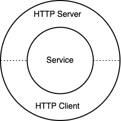

# dbtest

HTTP testing made easy for layered applications in Go.


## Layered Applications



See [the Clean Architecture][1] for details.


## Installation

Make a custom build of [protogo](https://github.com/protogodev/protogo):

```bash
$ protogo build --plugin=github.com/protogodev/httptest
```

<details open>
  <summary> Usage </summary>

```bash
$ protogo httptest -h
Usage: protogo httptest --spec=STRING --mode=STRING <source-file> <interface-name>

Arguments:
  <source-file>       source-file
  <interface-name>    interface-name

Flags:
  -h, --help           Show context-sensitive help.

      --out=STRING     output filename (default "./<srcPkgName>_<mode>_test.go")
      --fmt            whether to make the test code formatted
      --spec=STRING    the test specification in YAML
      --mode=STRING    generation mode (server or client)
```

</details>


## Examples

See [examples/usersvc](examples/usersvc).


## Documentation

Check out the [Godoc][2].


## License

[MIT](LICENSE)


[1]: https://blog.cleancoder.com/uncle-bob/2012/08/13/the-clean-architecture.html
[2]: https://pkg.go.dev/github.com/protogodev/httptest
